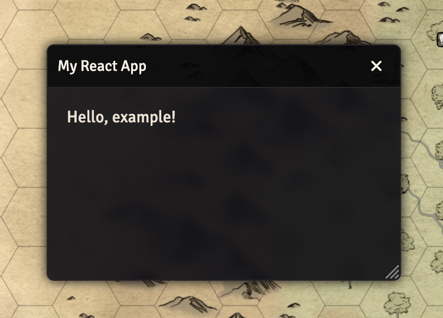

# Foundry VTT React

This package provides extensions of various Foundry VTT classes to support React applications development within Foundry.

## Installation

Currently supported FoundryVTT classes:

- `ReactApplicationV2`: A base application class for creating React-based applications in Foundry VTT.
- `ReactActorSheetV2`: An actor sheet class that uses React for rendering the UI, allowing the React app to listen for changes to the document using the native ActoSheetV2 lifecycle events.

## Usage

There are two important pieces to developing React applications in Foundry.

1. Creating your ReactApplicationV2 instance and passing in your React component.
2. Configuring ViteJS development server to work with your local FoundryVTT instance.

### Creating a ReactApplicationV2 Instance

To create a new React-powered Foundry application, you can instantiate the `ReactApplicationV2` class and provide your React component along with any initial properties and window options.

```javascript
// Basic component
function MyReactComponent(props) {
  return <div>Hello, {props.data}!</div>;
}

// Declare an instance and render it as a Foundry application
const app = new ReactApplicationV2({
  reactApp: MyReactComponent,
  initialProps: { data: "example" },
  window: { title: "My React App" },
  position: { width: 300, height: 200 },
});
app.render(true);
```


